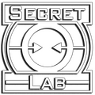

# 妥妥的出生游戏

---

> [!NOTE]
> 游戏基于 [SCP:CB](https://www.scpcbgame.com/)  
> 但是现在SL想脱离CB，花生的模型改动就是出于这个原因（有人说是因为版权？）

## 本游戏适合
- [x] 不爱交流
- [x] 爱随手关门
- [x] 喜欢拖时间
- [x] 喜欢摸鱼
- [x] 不等队友
- [x] 沉迷舔包
- [x] 公屏放歌

**等各种出生症患者**

## 本游戏含有可操控scp
- [x] ~~SCP-079~~ 颠佬
- [x] ~~SCP-096~~ 肘6
- [x] ~~SCP-106~~ 老头
- [x] ~~SCP-173~~ 花生
- [x] ~~SCP-049~~ 牢大
- [x] ~~SCP-939~~ 狗子
- [x] ~~我的队友~~ 079-2

## 你没有出生症？
玩个5小时，就能成功成为患者
[加入光荣的皇D吧](https://store.steampowered.com/app/700330/SCP__SCP_Secret_Laboratory/)  
  

> [!TIP]
> 为什么看不懂此贴？
> 等你玩了五个小时后你就看懂了
