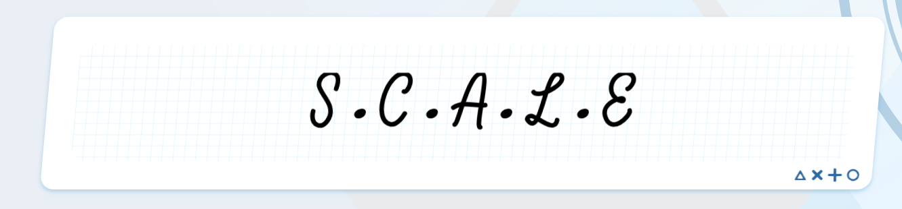
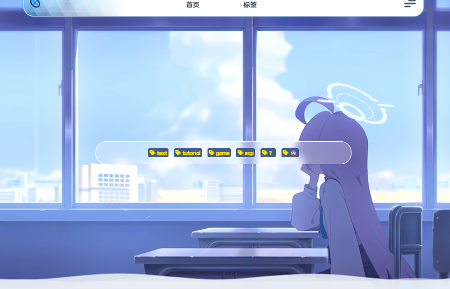
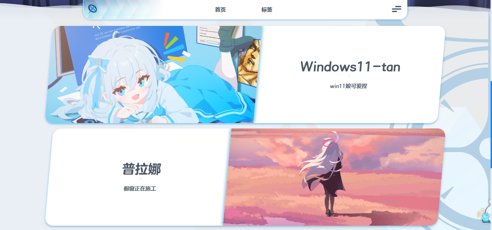
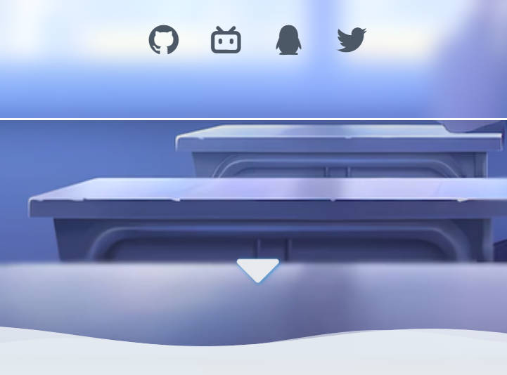
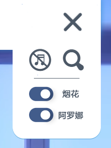
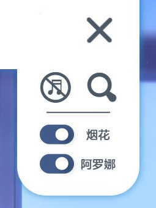

# 网页的更新与修改

---
# ⚙️2024.12.14
### 🔧添加主页滑动阻尼与签名(实验)
  $\qquad$ **·** 添加主页滑动阻尼与签名(实验)  
  $\qquad$ **·** 合并部分上游更新  
  $\qquad$ **·** 删除部分动画  

  ::: warning
  测试版更新
  :::

  

      

        
        
NEW

      

  

  $\qquad$ 详细信息点击[这里](https://github.com/naahi-i/ngnhomepage/commit/e90ec73b56be9703a2e9415ee5bd5eacf89b11a8)  

# ⚙️2024.11.17
### 🔧实现卡片列表无缝切换
  $\qquad$ **·** 实现卡片列表无缝切换  

  $\qquad$ 详细信息点击[这里](https://github.com/naahi-i/ngnhomepage/commit/b03f8c88f1968ca03d03d77a282d1fc8bd5a12c8)  

# ⚙️2024.11.10
### 🔧重新设计和布局 *（测试版本）*
  $\qquad$ **·** 将帖子列表移动到[帖子]菜单内（原[标签]）  
  $\qquad$ **·** 橱窗卡片采用轮播式  
  $\qquad$ **·** 优化帖子列表到帖子内的过渡动画  
  $\qquad$ **·** 优化banner随页面切换的动画   
  $\qquad$ **·** 新增帖子列表进入退出动画  
  $\qquad$ **·** 暂时移除Tags元素  

  

      

        
        
OLD [Showcase]

      
  
      

        
        
NEW [Showcase]

      

    

  

      

        
        
OLD [Tags]

      
  
      

        
        
NEW [Postlist]

      

    

  

      

        
        
OLD [Mean]

      
  
      

        
        
NEW [Mean]

      

    

  $\qquad$ 详细信息点击[这里](https://github.com/naahi-i/ngnhomepage/commit/bd6ad113c6c0623f08e806215d39dbe3040be73d)

# ⚙️2024.11.2
### 🔧增加橱窗
  $\qquad$ **·** 倾斜帖子列表

  

      

        
        
NEW

      

  

  $\qquad$ 详细信息点击[这里](https://github.com/naahi-i/ngn-myhomepage/commit/e690b8a453cc089147d1fb654a1e875f9f4d21e1)

# ⚙️2024.10.26
### 🔧修改iconfont
  $\qquad$ **·** 添加酷安coolapk  
  $\qquad$ **·** 更换图标为线条风格

  

      

        
        
NEW

      

  

  $\qquad$ 详细信息点击[这里](https://github.com/naahi-i/ngn-myhomepage/commit/99c29edcb4f136a0065e0c65da47f8e6391b240f)

# ⚙️2024.10.2
### 🔧重做totop
  $\qquad$ **·** 修改图标  
  $\qquad$ **·** 增加二次确认  
  $\qquad$ **·** 添加动效

  

      

        
        
OLD

      

      

        

          

            
            
Idle State

          

          

            
            
Reconfirmation

          

        

        
|______NEW______|

      

  

  $\qquad$ 详细信息点击[这里](https://github.com/naahi-i/ngn-myhomepage/commit/b4dfb304934f0a9509d6a63ecf6570efbf142eb7)

# ⚙️2024.9.30
### 🔧添加添加向下提示箭头
  $\qquad$ **·** 添加向下提示箭头

  

      

        
        
NEW

      

  

  $\qquad$ 详细信息点击[这里](https://github.com/naahi-i/ngn-myhomepage/commit/99c29edcb4f136a0065e0c65da47f8e6391b240f)

# ⚙️2024.9.17
### 🔧尝试修改首页样式
  $\qquad$ ·Welcomebox独占首页

  

      

        
        
NEW

      

  

  $\qquad$ 详细信息点击[这里](https://github.com/naahi-i/ngn-myhomepage/commit/a3fd3c090cf85f28f1843fb596453b8d148c90f9)

# ⚙️2024.9.16
### 🔧优化下拉菜单逻辑与微调样式
  $\qquad$ **·** 分隔条  
  $\qquad$ **·** 拨动开关动效  
  $\qquad$ **·** 点击空白处收回菜单

  $\qquad$ 详细信息点击[这里](https://github.com/naahi-i/ngn-myhomepage/commit/21f131ee407276987319aa8c3aad8c9aaa65875c)

### 🔧帖子内视频圆角
  $\qquad$ ·帖子内视频圆角

  $\qquad$ 详细信息点击[这里](https://github.com/naahi-i/ngn-myhomepage/commit/f9696b8c1f74bb71a86403434ce2dfc45eb0a858)

### 🔧修改下拉菜单样式，调整动画
  $\qquad$ **·** 调整层级  
  $\qquad$ **·** 添加阴影  
  $\qquad$ **·** 优化动画阻尼感  
  $\qquad$ **·** 删除模糊过度  

  

      

        
        
OLD

      
  
      

        
        
NEW

      

    

  $\qquad$ 详细信息点击[这里](https://github.com/naahi-i/ngn-myhomepage/commit/22e9d4aeebc67036bf299177c6d0e97b7a190a89)
# ⚙️2024.9.15
### 🔧调整下拉菜单效果 
  $\qquad$ **·** 调整动画速度  
  $\qquad$ **·** 添加模糊过渡

  $\qquad$ 详细信息点击[这里](https://github.com/naahi-i/ngn-myhomepage/commit/f52464f4edb5269339f4437d77fcb806bfb909af)

### 🔧下拉菜单添加拨动开关
  $\qquad$ **·** 重新排列菜单中元素  
  $\qquad$ **·** 添加两个拨动开关，阿罗娜与点击烟花效果可选隐藏

  $\qquad$ 详细信息点击[这里](https://github.com/naahi-i/ngn-myhomepage/commit/759b2314fc5d4f93187c389d040e3b98bab5d774)

### 🔧下拉菜单细节优化
  $\qquad$ **·** 点击搜索时菜单收回

  $\qquad$ 详细信息点击[这里](https://github.com/naahi-i/ngn-myhomepage/commit/f259fa995cf8fda6de6e8734ab09217db52bbd4c)

# ⚙️2024.9.14
### 🔧优化下拉菜单层级
  $\qquad$ **·** 使菜单在菜单控件之下

  $\qquad$ 详细信息点击[这里](https://github.com/naahi-i/ngn-myhomepage/commit/dbe11cd9cc7bf47619cf4d7b7b1a29c583ec655b)
